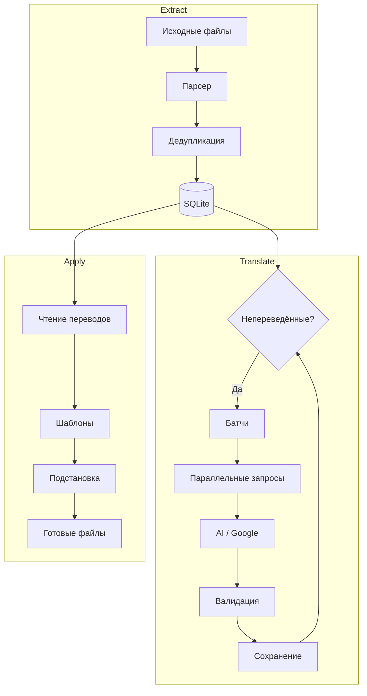
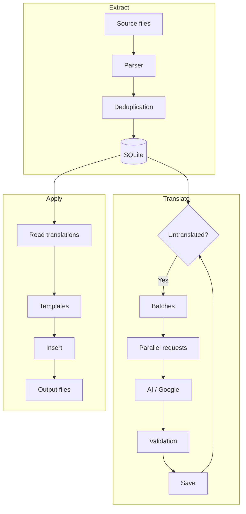

# LATTE - Language Asset Translation Toolkit Engine

Модульный инструмент для перевода игровых ресурсов с поддержкой AI.  
Modular tool for game resource translation with AI support.

---

<details>
<summary>🇷🇺 Русский</summary>

## Установка

```bash
pip install -r requirements.txt
```

## Конфигурация

Создайте `config.yaml`:

```yaml
pipeline:
  extractor: renpy      # Модуль извлечения строк
  translator: openai    # Модуль перевода (openai или google)
  applier: renpy        # Модуль сборки файлов

source:
  lang: en              # Исходный язык
  target_lang: ru       # Язык перевода

paths:
  new: ./new_tl         # Новые файлы от Ren'Py (шаблоны)
  old: ./old_tl         # Старые переводы (опционально)
  output: ./output      # Куда сохранять результат
  database: ./translations.db  # База данных переводов

translator:
  openai:
    api_key: ""
    model: gpt-4-turbo-preview
    batch: 10
    workers: 4

  google:
    batch: 50
```

## Использование

```bash
python latte.py all                                    # Полный цикл
python latte.py extract -s ./new_tl -o ./old_tl        # Извлечение строк
python latte.py translate                              # Перевод
python latte.py apply -t ./output                      # Сборка файлов
python latte.py db stats                               # Статистика БД
```

## Модули

### Экстракторы (Extractors)

Извлекают строки из исходных файлов и сохраняют в базу данных.

| Модуль | Формат | Файлы | Контекст | Переменные | Старые переводы |
|--------|--------|-------|----------|------------|-----------------|
| `renpy` | Ren'Py .rpy | `.rpy` | Имя персонажа | Пропускает `[var]`, `{var}`, `%(var)s` | Merge по ключу `текст+контекст` |
| `twine` | Twine/SugarCube | `.html` | Имя пассажа | Сохраняет `$var` в тексте | Не поддерживается |

**Ren'Py — поддерживаемые форматы:**

| Паттерн | Пример | Строк |
|---------|--------|-------|
| `old/new` | `old "text"` / `new "text"` | 2 |
| Диалог | `# name "text"` / `name "text"` | 2 |
| Диалог с командой | `# name "text"` / команда / `name "text"` | 3 |
| Цитированный | `# "text"` / `"text"` | 2 |
| Цитированный с командой | `# "text"` / команда / `"text"` | 3 |

**Twine — поддерживаемые форматы:**

| Элемент | Пример | Обработка |
|---------|--------|-----------|
| Текст | Обычный текст пассажа | Извлекается |
| Макросы | `<<set $var = 1>>` | Удаляются полностью |
| Переходы `->` | `[[текст->цель]]` | Извлекается отображаемый текст |
| Переходы `\|` | `[[текст\|цель]]` | Извлекается отображаемый текст |
| Переходы простые | `[[текст]]` | Извлекается текст |
| HTML теги | `` | Удаляются |
| Переменные | `$Gold` | Сохраняются в тексте |
| Команды `set` | `set $var` | Пропускаются |

### Переводчики (Translators)

Переводят непереведённые строки из базы данных.

| Модуль | Тип | Батчи | Параллельность | Переменные | Контекст | Валидация |
|--------|-----|-------|----------------|------------|----------|-----------|
| `openai` | OpenAI API | JSON массив | `workers` потоков | Сохраняет `[var]`, `{var}`, `%(var)s`, `$var` | Учитывает | Проверка переменных, скобок |
| `google` | Google Translate | `translate_batch` | 1 поток | Пропускает строки с переменными | Не учитывает | Проверка на пустоту и идентичность |

**OpenAI:**
- Формат запроса: `[{"id": 0, "context": "tara", "original": "Hello"}, ...]`
- Формат ответа: `[{"id": 0, "translate": "Привет"}, ...]`
- Валидация: все переменные из оригинала должны быть в переводе
- Автоматический ретрай при ошибках API
- Невалидные строки остаются в БД для следующего раунда
- Настраиваемая температура, модель, задержки

**Google:**
- Бесплатный, без API ключа
- Пропускает строки с `$var`, `[var]`, `{var}`, `%(var)s`, HTML тегами, макросами `<<...>>`
- Не учитывает контекст (имя персонажа)
- Рекомендуется для чернового перевода

### Сборщики (Appliers)

Создают готовые файлы перевода на основе шаблонов и переводов из БД.

| Модуль | Формат | Принцип | Без перевода |
|--------|--------|---------|--------------|
| `renpy` | Ren'Py .rpy | Замена в структуре шаблона | Оставляет оригинал |
| `twine` | Twine/SugarCube .html | Замена с маскировкой макросов и переходов | Оставляет оригинал |

**Ren'Py:**
- Сохраняет структуру оригинального файла
- Поддерживает все форматы: `old/new`, диалоги, цитированные
- Ищет перевод с учётом контекста (имя персонажа), fallback без контекста
- Промежуточные команды (`nvl clear`, `scene`) сохраняются

**Twine:**
- Декодирует HTML entities → маскирует макросы → маскирует переходы → заменяет текст → восстанавливает макросы → восстанавливает переходы с переводом → кодирует обратно
- Переходы `[[текст]]` → `[[перевод->текст]]`
- Переходы `[[текст->цель]]` → `[[перевод->цель]]`
- Макросы `<<...>>` не переводятся

## База данных

SQLite с одной таблицей:

```sql
CREATE TABLE translations (
    id INTEGER PRIMARY KEY AUTOINCREMENT,
    original TEXT NOT NULL,      -- оригинальный текст
    translation TEXT,            -- перевод (NULL если не переведено)
    source_lang TEXT NOT NULL,   -- исходный язык
    target_lang TEXT NOT NULL,   -- язык перевода
    context TEXT DEFAULT '',     -- контекст (имя персонажа/пассажа)
    UNIQUE(original, context, source_lang, target_lang)
);
```

**Команды:**
```bash
python latte.py db stats    # Статистика
python latte.py db vacuum   # Оптимизация
```

## Pipeline



## Структура проекта

```
latte/
├── latte.py              # CLI
├── config.yaml           # Конфигурация
├── core/
│   ├── database.py       # SQLite база данных
│   └── pipeline.py       # Оркестратор пайплайна
├── extractors/
│   ├── base.py           # Базовый класс
│   ├── renpy.py          # Ren'Py .rpy
│   └── twine.py          # Twine/SugarCube .html
├── translators/
│   ├── base.py           # Базовый класс
│   ├── openai.py         # OpenAI
│   └── google.py         # Google Translate
└── appliers/
    ├── base.py           # Базовый класс
    ├── renpy.py          # Ren'Py .rpy
    └── twine.py          # Twine/SugarCube .html
```

## Добавление новых модулей

### Экстрактор

Создать `extractors/myformat.py`:

```python
from extractors.base import BaseExtractor

class MyformatExtractor(BaseExtractor):
    def run(self, **kwargs) -> int:
        entries = [...]  # список dict с original, context
        normalized = [self._entry(original=e['original'], context=e['context']) for e in entries]
        return self.db.insert_batch(normalized)
```

Прописать в конфиге:
```yaml
pipeline:
  extractor: myformat
```

### Переводчик

Создать `translators/myapi.py`:

```python
from translators.base import BaseTranslator

class MyapiTranslator(BaseTranslator):
    def run(self, **kwargs) -> dict:
        for batch in self._get_batches():
            updates = self._translate(batch)
            self.db.update_batch(updates)
        return self.db.stats()
```

### Сборщик

Создать `appliers/myformat.py`:

```python
from appliers.base import BaseApplier

class MyformatApplier(BaseApplier):
    def run(self, **kwargs) -> int:
        translations = self.db.get_translated(self.source_lang, self.target_lang)
        # создать выходные файлы
        return files_count
```

</details>

---

<details open>
<summary>🇬🇧 English</summary>

## Installation

```bash
pip install -r requirements.txt
```

## Configuration

Create `config.yaml`:

```yaml
pipeline:
  extractor: renpy      # String extraction module
  translator: openai    # Translation module (openai or google)
  applier: renpy        # File assembly module

source:
  lang: en              # Source language
  target_lang: ru       # Target language

paths:
  new: ./new_tl         # New files from Ren'Py (templates)
  old: ./old_tl         # Old translations (optional)
  output: ./output      # Output directory
  database: ./translations.db  # Translation database

translator:
  openai:
    api_key: ""
    model: gpt-4-turbo-preview
    batch: 10
    workers: 4

  google:
    batch: 50
```

## Usage

```bash
python latte.py all                                    # Full pipeline
python latte.py extract -s ./new_tl -o ./old_tl        # Extract strings
python latte.py translate                              # Translate
python latte.py apply -t ./output                      # Assemble files
python latte.py db stats                               # Database stats
```

## Modules

### Extractors

Extract strings from source files and save to database.

| Module | Format | Files | Context | Variables | Old translations |
|--------|--------|-------|---------|-----------|------------------|
| `renpy` | Ren'Py .rpy | `.rpy` | Character name | Skips `[var]`, `{var}`, `%(var)s` | Merge by `text+context` key |
| `twine` | Twine/SugarCube | `.html` | Passage name | Keeps `$var` in text | Not supported |

**Ren'Py — supported formats:**

| Pattern | Example | Lines |
|---------|---------|-------|
| `old/new` | `old "text"` / `new "text"` | 2 |
| Dialogue | `# name "text"` / `name "text"` | 2 |
| Dialogue with command | `# name "text"` / command / `name "text"` | 3 |
| Quoted | `# "text"` / `"text"` | 2 |
| Quoted with command | `# "text"` / command / `"text"` | 3 |

**Twine — supported formats:**

| Element | Example | Processing |
|---------|---------|-------------|
| Text | Regular passage text | Extracted |
| Macros | `<<set $var = 1>>` | Fully removed |
| Links `->` | `[[text->target]]` | Display text extracted |
| Links `\|` | `[[text\|target]]` | Display text extracted |
| Simple links | `[[text]]` | Text extracted |
| HTML tags | `` | Removed |
| Variables | `$Gold` | Kept in text |
| `set` commands | `set $var` | Skipped |

### Translators

Translate untranslated strings from database.

| Module | Type | Batches | Parallel | Variables | Context | Validation |
|--------|------|---------|----------|-----------|---------|------------|
| `openai` | OpenAI API | JSON array | `workers` threads | Preserves `[var]`, `{var}`, `%(var)s`, `$var` | Uses | Variables, brackets |
| `google` | Google Translate | `translate_batch` | 1 thread | Skips strings with variables | Ignores | Empty/identical check |

**OpenAI:**
- Request format: `[{"id": 0, "context": "tara", "original": "Hello"}, ...]`
- Response format: `[{"id": 0, "translate": "Привет"}, ...]`
- Validation: all variables from original must be in translation
- Automatic retry on API errors
- Invalid strings remain in DB for next round
- Configurable temperature, model, delays

**Google:**
- Free, no API key needed
- Skips strings with `$var`, `[var]`, `{var}`, `%(var)s`, HTML tags, macros `<<...>>`
- Does not use context (character name)
- Recommended for rough/draft translation

### Appliers

Create ready-to-use translation files based on templates and DB translations.

| Module | Format | Method | No translation |
|--------|--------|--------|----------------|
| `renpy` | Ren'Py .rpy | Replace in template structure | Keeps original |
| `twine` | Twine/SugarCube .html | Replace with macro/link masking | Keeps original |

**Ren'Py:**
- Preserves original file structure
- Supports all formats: `old/new`, dialogues, quoted
- Looks up translation with context (character name), fallback without context
- Intermediate commands (`nvl clear`, `scene`) preserved

**Twine:**
- Decode HTML entities → mask macros → mask links → replace text → restore macros → restore links with translation → encode back
- Links `[[text]]` → `[[translation->text]]`
- Links `[[text->target]]` → `[[translation->target]]`
- Macros `<<...>>` are not translated

## Database

SQLite with a single table:

```sql
CREATE TABLE translations (
    id INTEGER PRIMARY KEY AUTOINCREMENT,
    original TEXT NOT NULL,      -- original text
    translation TEXT,            -- translation (NULL if not translated)
    source_lang TEXT NOT NULL,   -- source language
    target_lang TEXT NOT NULL,   -- target language
    context TEXT DEFAULT '',     -- context (character/passage name)
    UNIQUE(original, context, source_lang, target_lang)
);
```

**Commands:**
```bash
python latte.py db stats    # Statistics
python latte.py db vacuum   # Optimization
```

## Pipeline



## Project Structure

```
latte/
├── latte.py              # CLI
├── config.yaml           # Configuration
├── core/
│   ├── database.py       # SQLite database
│   └── pipeline.py       # Pipeline orchestrator
├── extractors/
│   ├── base.py           # Base class
│   ├── renpy.py          # Ren'Py .rpy
│   └── twine.py          # Twine/SugarCube .html
├── translators/
│   ├── base.py           # Base class
│   ├── openai.py         # OpenAI
│   └── google.py         # Google Translate
└── appliers/
    ├── base.py           # Base class
    ├── renpy.py          # Ren'Py .rpy
    └── twine.py          # Twine/SugarCube .html
```

## Adding New Modules

### Extractor

Create `extractors/myformat.py`:

```python
from extractors.base import BaseExtractor

class MyformatExtractor(BaseExtractor):
    def run(self, **kwargs) -> int:
        entries = [...]  # list of dicts with original, context
        normalized = [self._entry(original=e['original'], context=e['context']) for e in entries]
        return self.db.insert_batch(normalized)
```

Set in config:
```yaml
pipeline:
  extractor: myformat
```

### Translator

Create `translators/myapi.py`:

```python
from translators.base import BaseTranslator

class MyapiTranslator(BaseTranslator):
    def run(self, **kwargs) -> dict:
        for batch in self._get_batches():
            updates = self._translate(batch)
            self.db.update_batch(updates)
        return self.db.stats()
```

### Applier

Create `appliers/myformat.py`:

```python
from appliers.base import BaseApplier

class MyformatApplier(BaseApplier):
    def run(self, **kwargs) -> int:
        translations = self.db.get_translated(self.source_lang, self.target_lang)
        # create output files
        return files_count
```

</details>