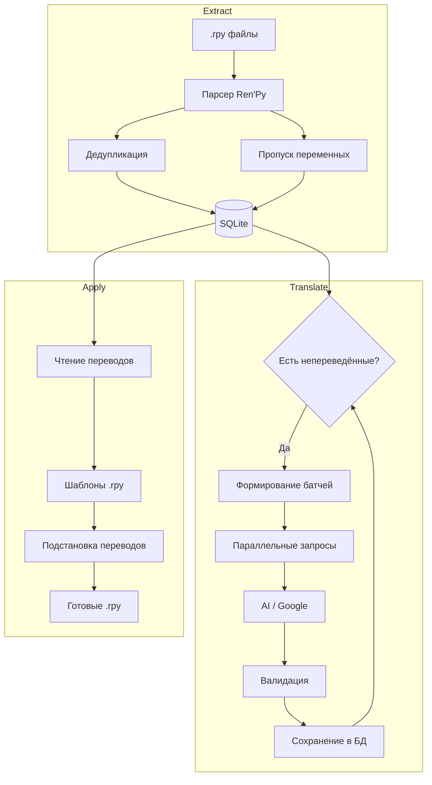
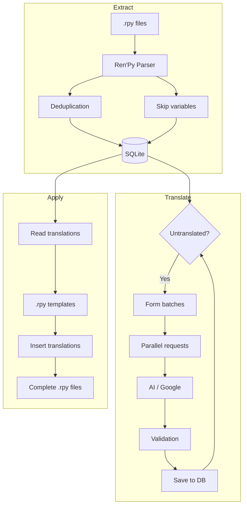

# LATTE - Language Asset Translation Toolkit Engine

<details>
<summary>🇷🇺 Нажмите, чтобы развернуть описание на русском</summary>

Модульный инструмент для перевода игровых ресурсов с поддержкой AI.

## Установка

```bash
pip install -r requirements.txt
```

## Конфигурация

Создайте `config.yaml`:

```yaml
pipeline:
  extractor: renpy      # Модуль извлечения строк
  translator: openai    # Модуль перевода (openai или google)
  applier: renpy        # Модуль сборки файлов

source:
  lang: en              # Исходный язык
  target_lang: ru       # Язык перевода

paths:
  new: ./new_tl         # Новые файлы от Ren'Py (шаблоны)
  old: ./old_tl         # Старые переводы (опционально)
  output: ./output      # Куда сохранять результат
  database: ./translations.db  # База данных переводов

translator:
  openai:
    api_key: ""
    model: gpt-4-turbo-preview
    batch: 10
    workers: 4

  google:
    batch: 50
```

## Использование

```bash
# Полный цикл
python latte.py all

# Отдельные этапы
python latte.py extract -s ./new_tl -o ./old_tl
python latte.py translate
python latte.py apply -t ./output

# Просмотр статистики
python latte.py db stats
```

## Pipeline



## Этапы

### 1. EXTRACT — Извлечение строк

Парсит `.rpy` файлы и сохраняет строки в базу данных.

**Форматы которые понимает парсер:**

| Тип | Пример | Контекст |
|-----|--------|----------|
| `old/new` | `old "Start Game"` / `new ""` | — |
| Диалоги | `# tara "Hello"` / `tara ""` | `tara` |
| Строки | `# "Menu"` / `""` | — |

**Что делает:**
- Извлекает оригинальный текст и перевод (если есть)
- Сохраняет имя персонажа как контекст
- Пропускает строки состоящие только из переменных (`[var]`, `{var}`)
- Убирает дубликаты (одинаковый текст + контекст)
- Если указана `paths.old` — подтягивает старые переводы

### 2. TRANSLATE — Перевод

Переводит непереведённые строки из базы данных.

**OpenAI:**
- Отправляет батчи строк в JSON формате
- Сохраняет переменные (`[var]`, `{var}`, `%(var)s`)
- Учитывает контекст (имя персонажа) для стиля речи
- Параллельные запросы через `workers` потоков
- Валидация: проверка сохранения переменных, пустых скобок
- Автоматический ретрай при ошибках
- Невалидные строки остаются в БД для следующего раунда

**Google Translate:**
- Бесплатный, но менее точный
- Пропускает строки с переменными (Google их ломает)
- Не учитывает контекст
- Рекомендуется для чернового перевода

### 3. APPLY — Сборка файлов

Создаёт готовые `.rpy` файлы перевода на основе шаблонов.

**Процесс:**
- Читает переводы из базы данных
- Для каждого файла из `paths.new` создаёт выходной файл
- Заменяет пустые `""` на переводы из БД
- Сохраняет структуру оригинального файла

## База данных

SQLite с одной таблицей:

```sql
CREATE TABLE translations (
    id INTEGER PRIMARY KEY AUTOINCREMENT,
    original TEXT NOT NULL,      -- оригинальный текст
    translation TEXT,            -- перевод (NULL если не переведено)
    source_lang TEXT NOT NULL,   -- исходный язык
    target_lang TEXT NOT NULL,   -- язык перевода
    context TEXT DEFAULT '',     -- имя персонажа или пусто
    UNIQUE(original, context, source_lang, target_lang)
);
```

**Команды:**
```bash
python latte.py db stats    # Статистика
python latte.py db vacuum   # Оптимизация
```

## Структура проекта

```
latte/
├── latte.py              # CLI
├── config.yaml           # Конфигурация
├── core/
│   ├── database.py       # SQLite база данных
│   └── pipeline.py       # Оркестратор пайплайна
├── extractors/
│   ├── base.py           # Базовый класс экстрактора
│   └── renpy.py          # Экстрактор Ren'Py .rpy
├── translators/
│   ├── base.py           # Базовый класс переводчика
│   ├── openai.py         # OpenAI переводчик
│   └── google.py         # Google Translate переводчик
└── appliers/
    ├── base.py           # Базовый класс сборщика
    └── renpy.py          # Сборщик Ren'Py .rpy
```

## Добавление новых модулей

### Новый экстрактор

Создать `extractors/myformat.py`:

```python
from extractors.base import BaseExtractor

class MyformatExtractor(BaseExtractor):
    def run(self, **kwargs) -> int:
        # Извлечь строки из своего формата
        # Сохранить через self.db.insert_batch(entries)
        return count
```

Прописать в конфиге:
```yaml
pipeline:
  extractor: myformat
```

### Новый переводчик

Создать `translators/myapi.py`:

```python
from translators.base import BaseTranslator

class MyapiTranslator(BaseTranslator):
    def run(self, **kwargs) -> dict:
        # Перевести через свой API
        # Обновить через self.db.update_batch(updates)
        return self.db.stats()
```

### Новый сборщик

Создать `appliers/myformat.py`:

```python
from appliers.base import BaseApplier

class MyformatApplier(BaseApplier):
    def run(self, **kwargs) -> int:
        # Собрать файлы в своём формате
        return files_count
```

</details>

---

Modular tool for game resource translation with AI support.

## Installation

```bash
pip install -r requirements.txt
```

## Configuration

Create `config.yaml`:

```yaml
pipeline:
  extractor: renpy      # String extraction module
  translator: openai    # Translation module (openai or google)
  applier: renpy        # File assembly module

source:
  lang: en              # Source language
  target_lang: ru       # Target language

paths:
  new: ./new_tl         # New Ren'Py files (templates)
  old: ./old_tl         # Old translations (optional)
  output: ./output      # Output directory
  database: ./translations.db  # Translation database

translator:
  openai:
    api_key: ""
    model: gpt-4-turbo-preview
    batch: 10
    workers: 4

  google:
    batch: 50
```

## Usage

```bash
# Full pipeline
python latte.py all

# Individual stages
python latte.py extract -s ./new_tl -o ./old_tl
python latte.py translate
python latte.py apply -t ./output

# View statistics
python latte.py db stats
```

## Pipeline



## Stages

### 1. EXTRACT — Extract strings

Parses `.rpy` files and saves strings to the database.

**Formats the parser understands:**

| Type | Example | Context |
|------|---------|---------|
| `old/new` | `old "Start Game"` / `new ""` | — |
| Dialogues | `# tara "Hello"` / `tara ""` | `tara` |
| Strings | `# "Menu"` / `""` | — |

**What it does:**
- Extracts original text and translation (if available)
- Saves character name as context
- Skips strings consisting only of variables (`[var]`, `{var}`)
- Removes duplicates (same text + context)
- If `paths.old` is specified, pulls in old translations

### 2. TRANSLATE — Translation

Translates untranslated strings from the database.

**OpenAI:**
- Sends batches of strings in JSON format
- Preserves variables (`[var]`, `{var}`, `%(var)s`)
- Takes context (character name) into account for speech style
- Parallel requests via `workers` threads
- Validation: checks preservation of variables, empty brackets
- Automatic retry on errors
- Invalid strings remain in DB for next round

**Google Translate:**
- Free but less accurate
- Skips strings with variables (Google breaks them)
- Does not consider context
- Recommended for rough/draft translation

### 3. APPLY — Assemble files

Creates ready-to-use `.rpy` translation files based on templates.

**Process:**
- Reads translations from the database
- Creates output file for each file from `paths.new`
- Replaces empty `""` with translations from DB
- Preserves the structure of the original file

## Database

SQLite with a single table:

```sql
CREATE TABLE translations (
    id INTEGER PRIMARY KEY AUTOINCREMENT,
    original TEXT NOT NULL,      -- original text
    translation TEXT,            -- translation (NULL if not translated)
    source_lang TEXT NOT NULL,   -- source language
    target_lang TEXT NOT NULL,   -- target language
    context TEXT DEFAULT '',     -- character name or empty
    UNIQUE(original, context, source_lang, target_lang)
);
```

**Commands:**
```bash
python latte.py db stats    # Statistics
python latte.py db vacuum   # Optimization
```

## Project Structure

```
latte/
├── latte.py              # CLI
├── config.yaml           # Configuration
├── core/
│   ├── database.py       # SQLite database
│   └── pipeline.py       # Pipeline orchestrator
├── extractors/
│   ├── base.py           # Base extractor class
│   └── renpy.py          # Ren'Py .rpy extractor
├── translators/
│   ├── base.py           # Base translator class
│   ├── openai.py         # OpenAI translator
│   └── google.py         # Google Translate translator
└── appliers/
    ├── base.py           # Base applier class
    └── renpy.py          # Ren'Py .rpy applier
```

## Adding New Modules

### New Extractor

Create `extractors/myformat.py`:

```python
from extractors.base import BaseExtractor

class MyformatExtractor(BaseExtractor):
    def run(self, **kwargs) -> int:
        # Extract strings from your format
        # Save via self.db.insert_batch(entries)
        return count
```

Set in config:
```yaml
pipeline:
  extractor: myformat
```

### New Translator

Create `translators/myapi.py`:

```python
from translators.base import BaseTranslator

class MyapiTranslator(BaseTranslator):
    def run(self, **kwargs) -> dict:
        # Translate using your API
        # Update via self.db.update_batch(updates)
        return self.db.stats()
```

### New Applier

Create `appliers/myformat.py`:

```python
from appliers.base import BaseApplier

class MyformatApplier(BaseApplier):
    def run(self, **kwargs) -> int:
        # Assemble files in your format
        return files_count
```